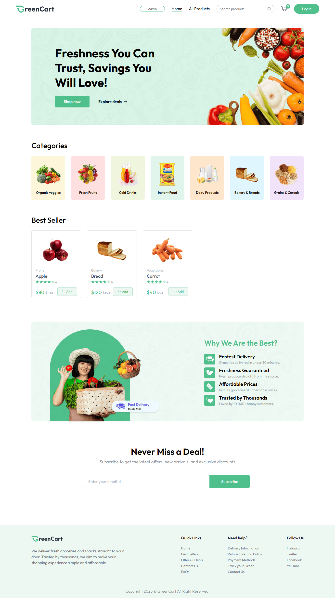
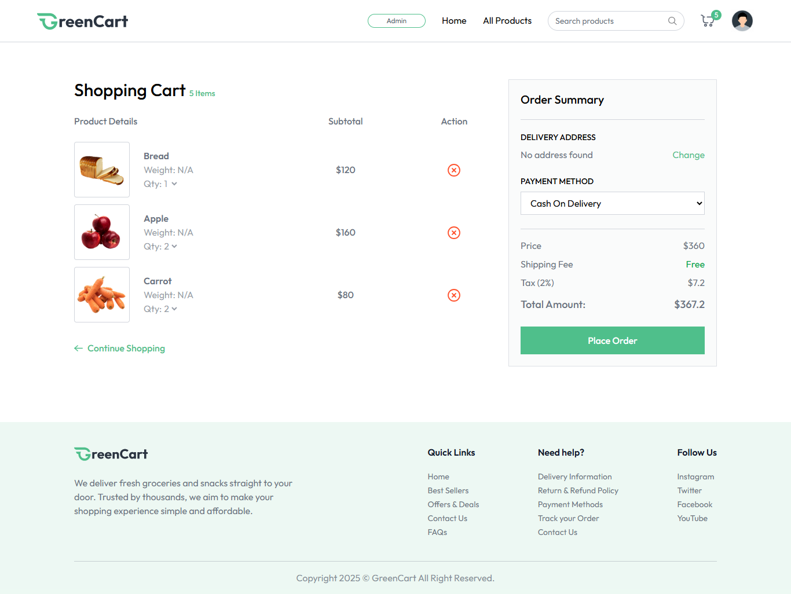
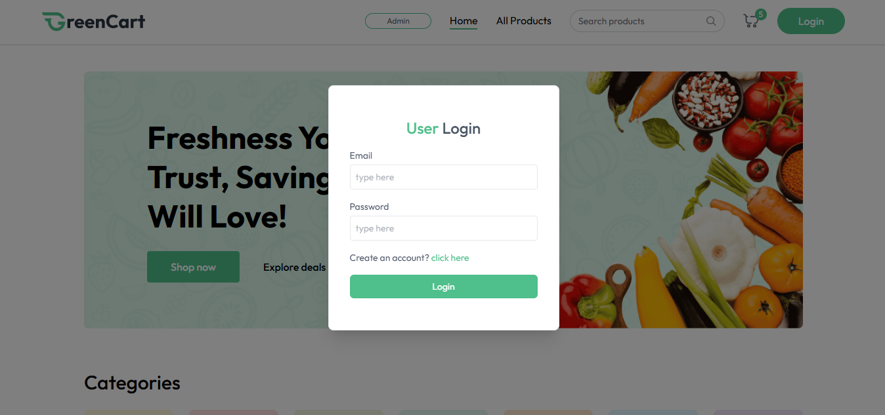

# GreenCart – Full Stack Grocery E-commerce Store

## Overview

GreenCart is a full-stack online grocery platform offering product browsing, cart functionality, and secure checkout. Built to simulate real e-commerce workflow: product listing, user actions, backend data management, and order flow.

## 🚀 My Role

Full Stack Developer (React.js, Node.js, MongoDB, Express.js, Tailwind CSS)

## Features

- Product listings with categories, search, filters
- Shopping cart with add/remove functionality
- Secure checkout process
- Responsive layout with modern UI design
- Admin-like functions (if any) e.g., product management, inventory

## Tech Stack

React.js | Node.js | MongoDB | Express.js | Tailwind CSS

## 📦 Live Demo

[Live Demo](https://green-cart-grocery-store.vercel.app/)

## 📂 GitHub Repo

[GitHub Repository](https://github.com/ArsalanAteeq11/GreenCart-grocery-store)

## 📸 Screenshots

### Homepage

### Cart Page

### Login Page

> **Why this project matters:**  
> It demonstrates full e-commerce capabilities — cart, checkout, backend + frontend working together. Useful for clients who want stores or product-based sites.
